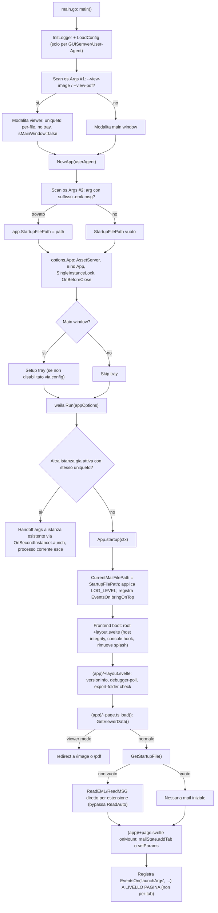
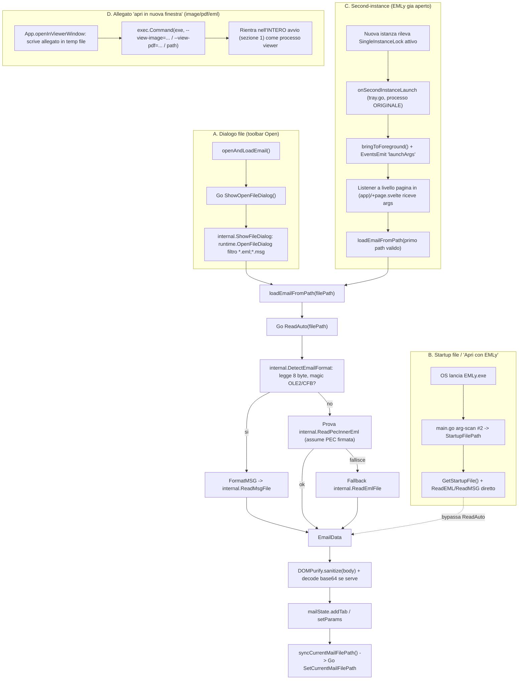
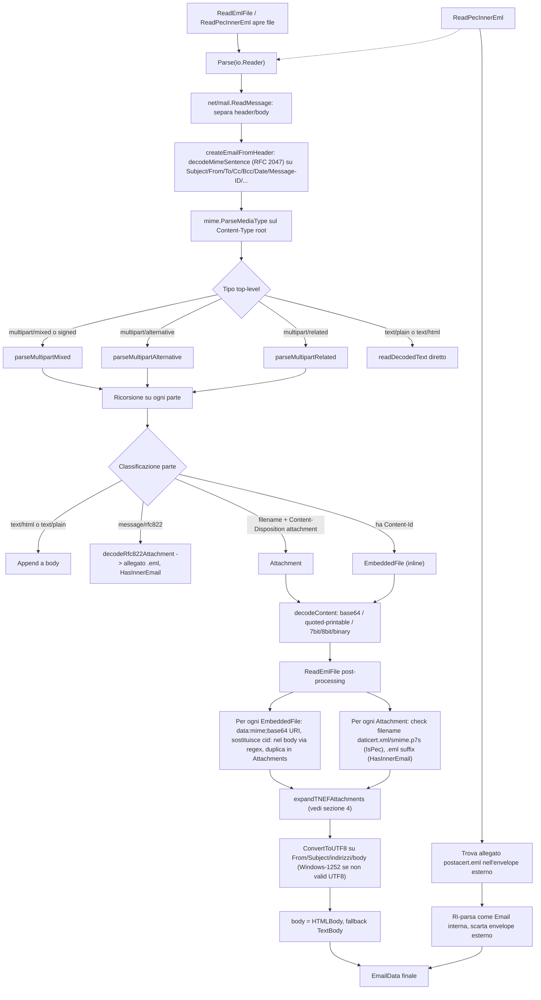
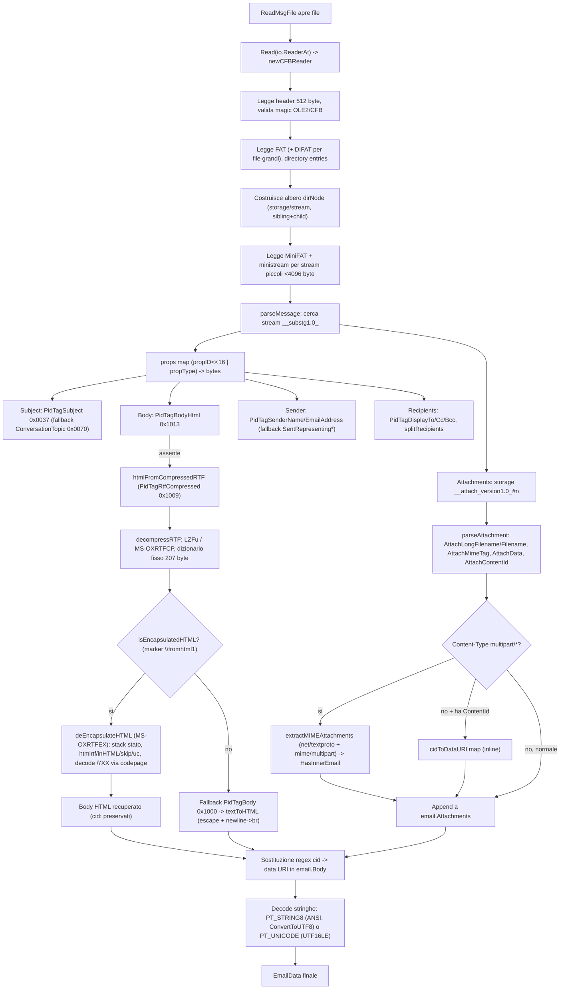
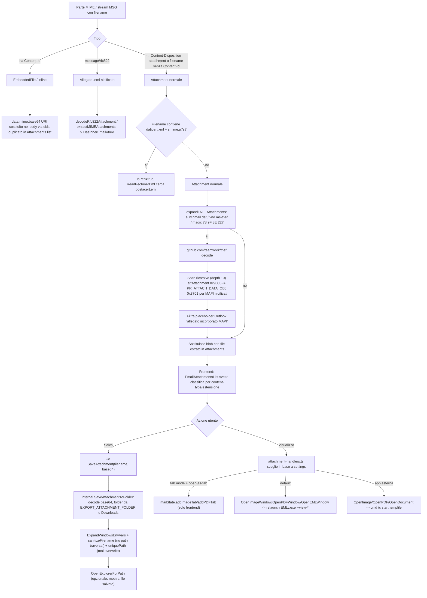
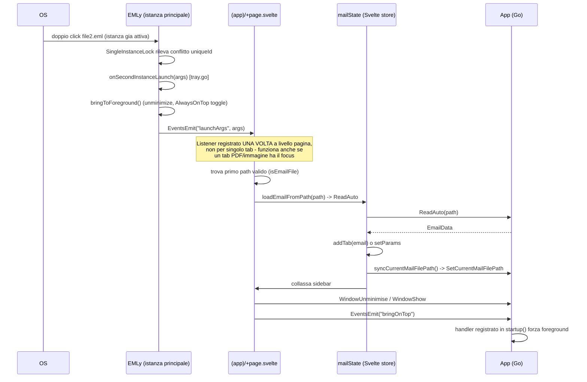

<!-- title: EMLy — Startup, Read/Parse, Attachments -->

# EMLy — Startup, Lettura, Parsing, Allegati

## 1. Avvio processo

## 2. Apertura file — 4 percorsi che convergono sul parser

## 3. Parsing EML — `backend/utils/mail/mailparser.go` + `eml_reader.go`

## 3b. Parsing MSG — `msg_reader.go` + `rtf.go` (OLE2/CFB fatto a mano)

## 4. Estrazione/gestione allegati

## 5. Tab state / sync / second-instance (sequence)

## Note chiave

- Nessun drag-and-drop: apertura solo via dialogo file, associazione OS ("apri con"), o second-instance relaunch.
- `ReadAuto` fa auto-detect formato + tentativo PEC; il percorso B (startup file) lo bypassa e chiama `ReadEML`/`ReadMSG` diretto in base all'estensione.
- Nessuna cache lato Go: ogni `ReadEML`/`ReadMSG`/`ReadAuto` ri-parsa da disco. L'unica "cache" e l'array `mailState.tabs` in memoria nel frontend.
- Ogni finestra viewer (immagine/PDF/eml) e un processo `EMLy.exe` separato, rientra nell'intero avvio con flag `--view-image`/`--view-pdf`, `SingleInstanceLock` per-file.
- `beforeClose` blocca chiusura finestra principale finche ci sono viewer figli aperti (`openImages`/`openPDFs` map).
